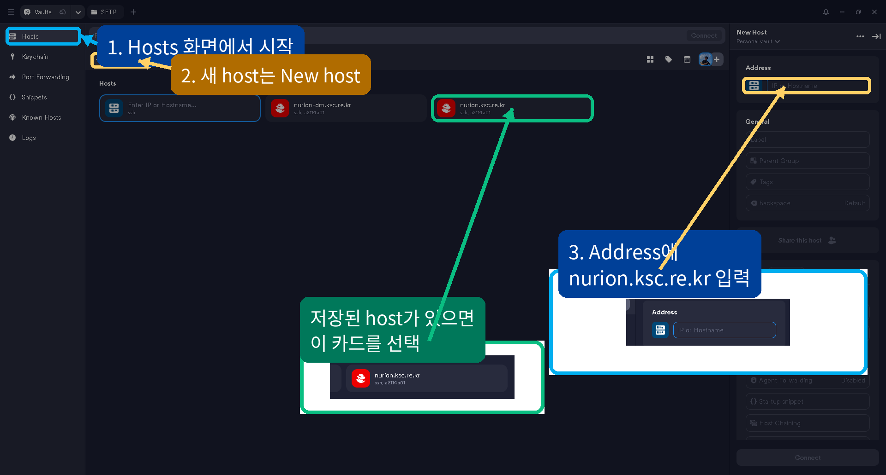
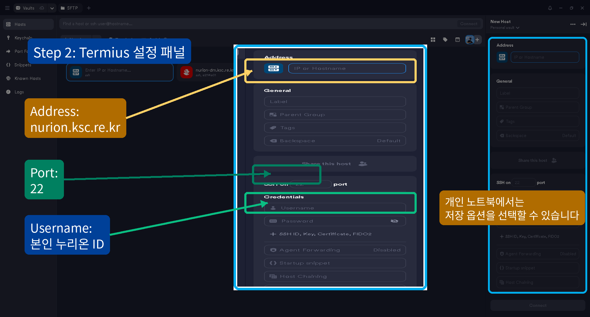
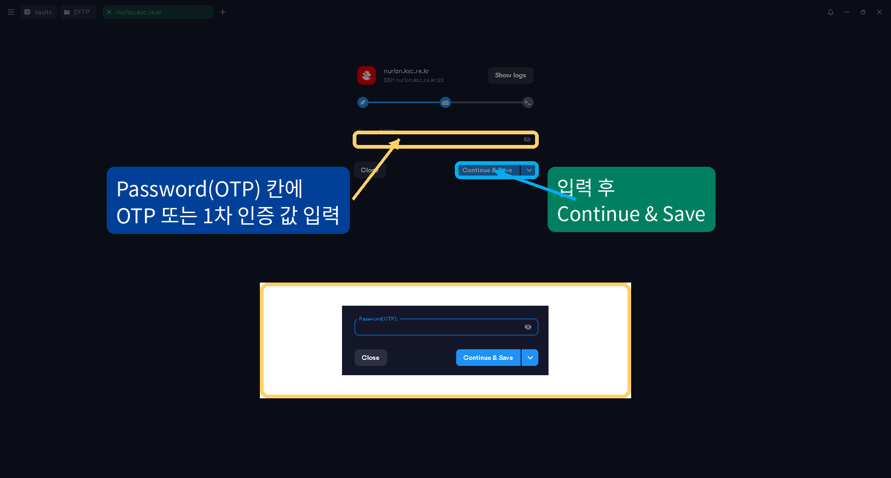
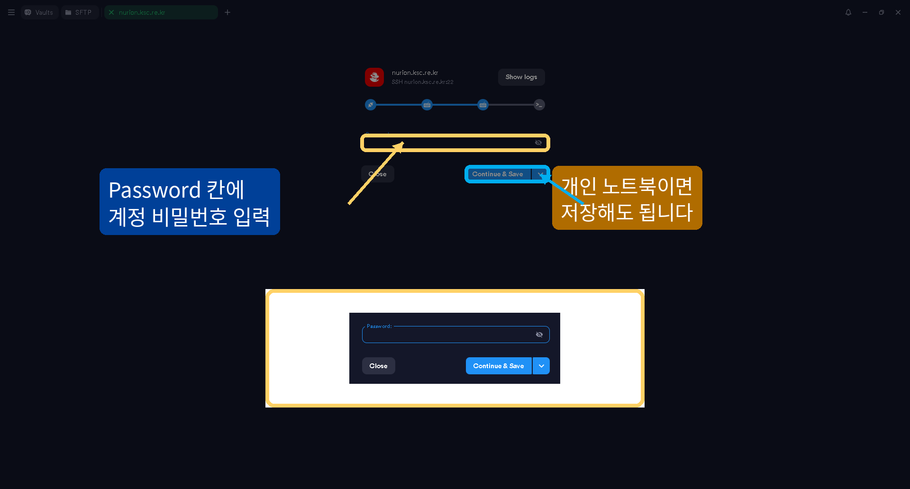
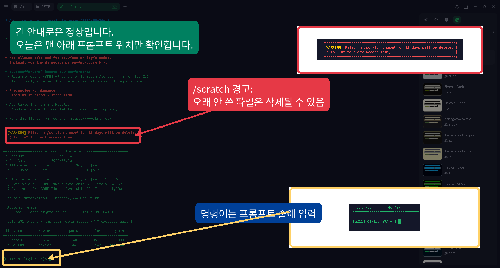
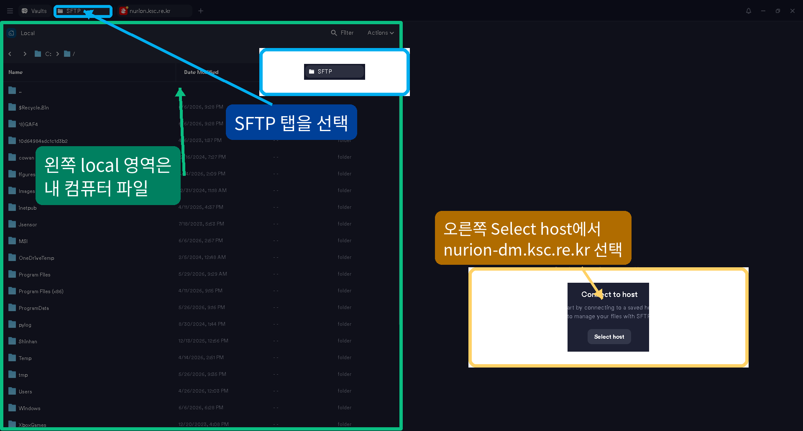

# 2. Termius로 원격 리눅스 서버 접속하기

이 장에서는 Termius로 누리온에 접속하고, 서버 안에서 안전한 연습 폴더를 만듭니다.

## SSH란?

SSH는 Secure Shell의 약자입니다. 네트워크를 통해 다른 컴퓨터, 보통 리눅스 서버에 안전하게 접속하기 위한 방식입니다.

이번 워크숍에서는 SSH 명령어를 직접 입력하지 않고 Termius 앱이 SSH 접속을 대신 시작합니다.

쉽게 말하면:

```text
내 컴퓨터의 Termius  --SSH-->  누리온 원격 리눅스 서버의 터미널
```

## 접속에 필요한 정보

보통 아래 정보가 필요합니다.

| Termius 항목 | 누리온 예시 |
|---|---|
| Address | `nurion.ksc.re.kr` |
| Username | 본인 누리온 ID |
| Port | `22` |
| Password(OTP) | OTP 또는 1차 인증 값 |
| Password | 누리온 계정 비밀번호 |

서버 주소와 사용자명은 수업 안내 또는 서버 관리자에게 받은 값을 사용합니다.

## Termius host 만들기

Termius에서 `Hosts` 화면을 엽니다.



새 host를 만들 때는 아래처럼 입력합니다.



```text
Address:  nurion.ksc.re.kr
Port:     22
Username: 본인 누리온 ID
Label:    Nurion login
```

위 값을 입력한 뒤 누리온 접속을 시작합니다.

## 로그인 순서

누리온 접속을 시작하면 Termius가 인증 정보를 물어봅니다.

1. `Password(OTP)` 창에 OTP 또는 1차 인증 값을 입력합니다.
2. `Password` 창에 누리온 계정 비밀번호를 입력합니다.
3. 입력한 글자가 화면에 보이지 않아도 정상입니다.
4. 접속에 성공하면 긴 누리온 안내문과 프롬프트가 보입니다.







## 처음 접속할 때 나오는 확인

처음 접속하면 Termius가 서버 연결 확인을 물을 수 있습니다.

```text
The authenticity of host 'nurion.ksc.re.kr (...)' can't be established.
Are you sure you want to continue connecting?
```

Termius 화면에서는 `Accept`, `Continue`, 또는 `Yes` 같은 버튼으로 보일 수 있습니다. 주소가 `nurion.ksc.re.kr`인지 확인하고 진행합니다.

## 접속 성공 확인

접속 후 아래 명령어를 실행합니다.

아래 예시에서 `server$`는 서버 프롬프트입니다. 직접 입력하지 말고 뒤의 명령어만 입력합니다.

```bash
server$ hostname
server$ whoami
server$ pwd
```

- `hostname`: 접속한 서버 이름
- `whoami`: 현재 사용자명
- `pwd`: 현재 위치

## 접속 종료

원격 서버에서 빠져나오려면:

```bash
server$ exit
```

Termius 세션이 닫히거나 host 화면으로 돌아오면 로그아웃된 것입니다.

## 파일 전송은 Termius SFTP 탭에서 하기

파일을 올리고 내려받을 때는 Termius의 `SFTP` 탭을 사용합니다.



누리온에서는 명령어 로그인 host와 파일 전송 host를 구분합니다.

| 용도 | Host |
|---|---|
| 명령어 입력용 SSH 로그인 | `nurion.ksc.re.kr` |
| 파일 전송용 SFTP | `nurion-dm.ksc.re.kr` |

SFTP host를 만들 때는 아래처럼 입력합니다.

```text
Remote host: nurion-dm.ksc.re.kr
Username: 본인 누리온 ID
Protocol: SFTP
Remote folder: /home01/본인ID
```

## 안전한 연습 폴더 만들기

이제 원격 서버에 접속한 상태라고 가정합니다.

서버에서 다음 명령어를 실행하세요.

```bash
server$ mkdir -p ~/linux-practice
server$ cd ~/linux-practice
server$ pwd
```

출력 경로가 `linux-practice`로 끝나면 성공입니다.

예:

```text
/home/student01/linux-practice
```

앞으로 위험할 수 있는 실습은 이 폴더 안에서만 합니다.

## 길을 잃었을 때

내가 어디에 있는지 모르겠다면:

```bash
server$ pwd
```

연습 폴더로 돌아가려면:

```bash
server$ cd ~/linux-practice
```

## 로컬 컴퓨터와 원격 서버 구분하기

매우 중요합니다.

- Termius 앱, Hosts 화면, SFTP의 local 쪽은 내 컴퓨터입니다.
- Termius로 로그인한 뒤 명령어를 입력하는 터미널은 누리온 서버입니다.
- SSH 접속 후에는 서버 파일을 보고 있는 것입니다. 내 Windows 바탕화면이나 macOS Desktop을 보고 있는 것이 아닙니다.

## 체크포인트

1. Termius에서 누리온 SSH 로그인에 사용하는 주소는 무엇인가요?
2. 파일 전송용 host 주소는 SSH 로그인 주소와 어떻게 다른가요?
3. 서버 접속을 종료하려면 어떤 명령어를 쓰나요?
4. 왜 `~/linux-practice` 같은 연습 폴더를 만들어야 하나요?
